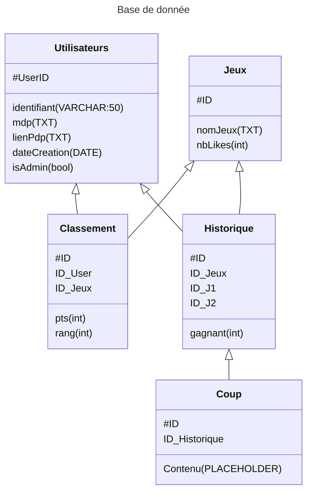

# Projet Jouer Pour Être Gagnant -- INFO204

> [!NOTE]
> Accès rapide aux parties de la doc.
> - [TODOLIST](./TODO.md)
> - [Ideas](./Ideas.md)

# Table des matières

- [Le groupe](#le-groupe)
- [Le projet](#le-projet)

# Le groupe

Nom : JPEG (Ailes-hein)\
Membres :
- [BELLOT Aline](https://github.com/TheWarior73)
- [GUYON Eddy](https://github.com/synnfall)
- [DELAMEZIÈRE Lucas](https://github.com/bouncii)
- [LONGERET-CHAVANEL Evan](https://github.com/ItsMe-Truncation)

`N° Groupe : 14`

# Le projet

## Présentation

Avez vous déjà rêvé de tricher sur vos jeux préféré ? Marre de perdre ? 
Et bien NOUS avons la solution ! 
En effet, nous vous proposons aujourd'hui un site web dont le concept est de gagner par tout les moyens, même si cela nécessite un recours à des moyens un peu douteux !
Le but : faire un site regroupant pleins de jeu incluant un système de triche. Mais attention ! Veillez à ne pas vous faire démasquer par vos opposants, sous peine de se faire "bannir". Il faut donc être capable de ne pas être très honnête sans se faire remarquer, pas vu pas pris ! 

## La base de donnée

