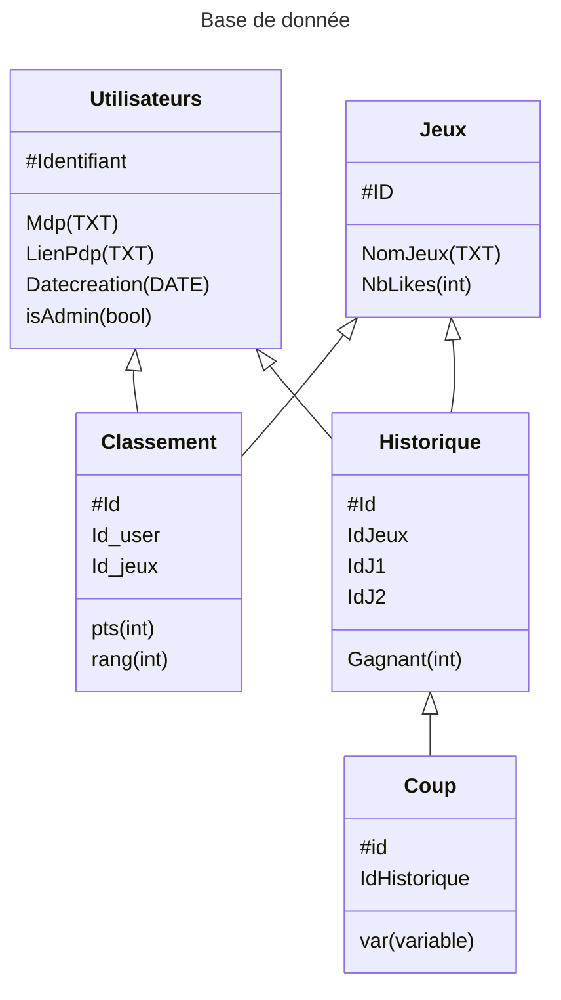

# Projet Jouer Pour Être Gagnant -- INFO204

> [!NOTE]
> Accès rapide aux parties de la doc.
> - [TODOLIST](./TODO.md)
> - [Ideas](./Ideas.md)

# Table des matières

- [Le groupe](#le-groupe)
- [Le projet](#le-projet)

# Le groupe

Nom : JPEG (Ailes-hein)\
Membres :
- [BELLOT Aline](https://github.com/TheWarior73)
- [GUYON Eddy](https://github.com/synnfall)
- [DELAMEZIÈRE Lucas](https://github.com/bouncii)
- [LONGERET-CHAVANEL Evan](https://github.com/ItsMe-Truncation)

`N° Groupe : 14`

# Le projet

## La base de donnée
