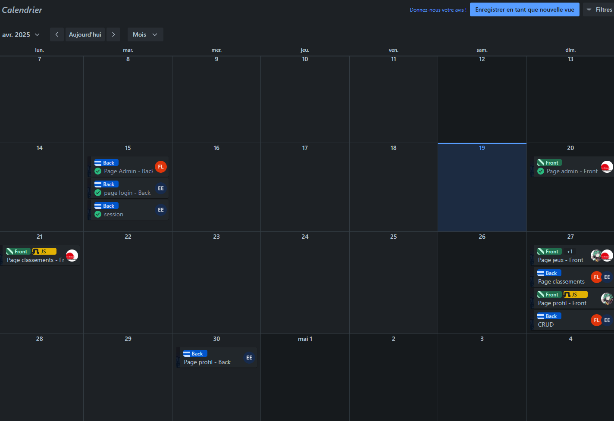

# Organisation et Répartition des tâches
Projet J.P.E.G. - Groupe N° 14 \
• [Lien GitHub](https://github.com/synnfall/JPEG)

> [!NOTE]
> Chef de projet : Eddy Guyon

---

Gestion de l'integrité du code : (code reviews)
- Eddy [back]
- Aline [front]

## Frontend
> Aline
- navbar
- css, js, html (php)
    - Page d'accueil
    - Page Jeux
    - Page classements

- Style page.s admin

> Lucas
- css, js, html (php)
    - Page de connexion
    - profil public
    - profil privé
    - pfc

> Aline & Lucas
- Css Global
- Design sur figma

## Backend
> Eddy
- Setup [serveur dev](https://jpeg.cmi-info.fr)
- pfc
- session
- matchmaking
- multijoueur

> Evan
- Page Admin
- Profil Public
- likes

> Eddy & Evan
- API
- CRUD
- Profil prive

> Aline
- Structure BDD phpmyadmin + diagrames.

# Deadlines
Fin avril. Not up to Date.
